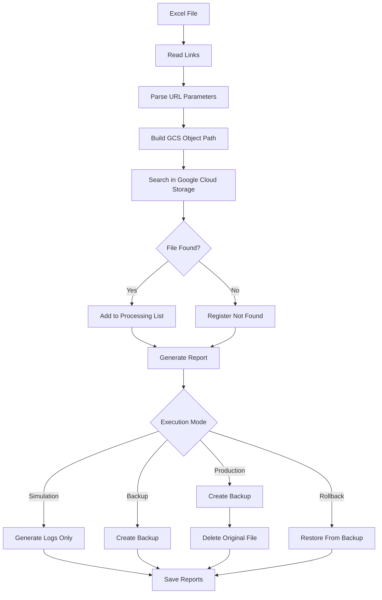

# Invoice Bucket Manager

Python automation tool for locating, validating, backing up, restoring and safely removing invoice files stored in Google Cloud Storage.

This project was created to reduce manual work and operational risk when incorrect invoice files are uploaded to a cloud storage bucket.

---

## 🚀 Overview

The tool reads invoice URLs from an Excel spreadsheet, extracts the required parameters, builds the expected object path inside Google Cloud Storage and validates whether the file exists.

After validation, the script can operate in different execution modes:

* Simulation Mode
* Backup Mode
* Production Mode
* Rollback Mode

The solution includes:

* Backup before deletion
* Rollback support
* TXT execution logs
* XLSX execution logs
* CSV reports
* XLSX reports
* CLI execution
* YAML-based configuration

---

## 📥 Input Source

The script reads invoice URLs from an Excel file.

Expected column:

```text
link
```

Example:

```text
https://example.com/download/2062/2/31934/BT/
https://example.com/download/2062/2/5482/GD/
```

---

## 🧩 File Path Logic

The object path is generated based on URL parameters.

Pattern:

```text
TYPE/COMPANY_CODE/UNIT_CODE/COMPANY_CODE_UNIT_CODE_INVOICE_CODE.pdf
```

Examples:

```text
BT/2/31934/2_31934_31934_2.pdf
GD/2/5482/2_5482_21149.pdf
```

Where:

* BT = Low Voltage
* GD = Distributed Generation
* COMPANY_CODE = Company code
* UNIT_CODE = Consumer unit code
* INVOICE_CODE = Invoice identifier

---

## 🧰 Technologies

* Python
* Google Cloud Storage
* Pandas
* OpenPyXL
* PyYAML
* CLI Automation
* Excel Processing
* Logging
* Backup & Recovery Workflow

---

## ⚙️ Installation

### Requirements

* Python 3.10+
* Google Cloud SDK
* Access to Google Cloud Storage

### Install Dependencies

Using requirements.txt:

```bash
pip install -r requirements.txt
```

Or manually:

```bash
pip install pandas openpyxl pyyaml google-cloud-storage
```

---

## 🔐 Google Cloud Authentication

Login to Google Cloud:

```bash
gcloud auth login
```

Configure Application Default Credentials:

```bash
gcloud auth application-default login
```

Validate access:

```bash
gsutil ls
```

---

## 📁 Project Structure

```text
Google-Storage/
│
├── main.py
├── config.yaml
├── faturas_registradas.xlsx
├── requirements.txt
│
├── docs/
│   ├── logs/
│   └── screenshots/
│
└── reports/
```

---

## ⚙️ Configuration

Example configuration file:

```yaml
bucket: example-bucket

excel:
  file: faturas_registradas.xlsx
  column: link

tipos:
  - BT
  - GD

paths:
  logs: docs/logs
  reports: reports
  backup_prefix: backup
```

---

## 🚀 Execution Modes

### 🧪 Simulation Mode

```bash
python main.py --mode simulacao
```

Features:

* Reads Excel file
* Parses URLs
* Searches files in Google Cloud Storage
* Generates reports
* Generates logs
* Simulates backup
* Simulates deletion

No changes are made to the bucket.

---

### 📦 Backup Mode

```bash
python main.py --mode backup
```

Features:

* Reads Excel file
* Searches files
* Creates backup copies
* Preserves original files
* Generates reports
* Generates logs

---

### 💥 Production Mode

```bash
python main.py --mode producao
```

Features:

* Reads Excel file
* Searches files
* Creates backup copies
* Deletes original files
* Generates reports
* Generates logs

Required confirmations:

```text
excluir itens
confirmar producao
```

---

### 🔁 Rollback Mode

```bash
python main.py --mode rollback --data-backup 2026-06-05
```

Features:

* Restores files from backup
* Recreates original structure
* Generates execution logs
* Supports recovery after accidental deletion

---

## 🛡️ Safety Workflow

The script does not execute deletion automatically.

Before processing, the user must explicitly confirm the operation.

Production mode requires double confirmation before any file is deleted.

Security mechanisms:

* Simulation Mode
* Backup before deletion
* Double confirmation
* Rollback support
* Audit logs
* Execution reports

---

## 🗂️ Backup Strategy

Backups are stored inside Google Cloud Storage using the same original structure.

Example:

```text
backup/2026-06-05/BT/2/31934/2_31934_31934_2.pdf
backup/2026-06-05/GD/2/5482/2_5482_21149.pdf
```

This structure allows fast recovery and rollback operations.

---

## 📄 Reports and Logs

### Logs

```text
docs/logs/YYYY-MM-DD/
├── log_execucao.txt
└── log_execucao.xlsx
```

### Reports

```text
reports/
├── relatorio.csv
└── relatorio.xlsx
```

---

## 📊 Execution Example

```text
[2026-06-05 12:20:32] Início da execução
[2026-06-05 12:20:32] MODO EXECUÇÃO: backup
[2026-06-05 12:20:36] Total de links: 38
[2026-06-05 12:20:36] Iniciando busca...

✅ ENCONTRADO: BT/2/31934/2_31934_2.pdf
✅ ENCONTRADO: GD/2/5482/2_5482_21149.pdf
❌ NÃO_ENCONTRADO: https://example.com/download/2062/2/2112224/BT/

Total encontrados: 37
```

---

## 📸 Screenshots

### File Search Validation


### Backup Execution


### Process Completed


> Sensitive information such as company names, bucket names, domains and invoice identifiers has been anonymized.

---

## 🧭 Workflow



---

## ✅ Implemented Features

* [x] Read invoice links from Excel
* [x] Parse URL parameters
* [x] Build Google Cloud Storage object paths
* [x] Search files inside the bucket
* [x] Simulation mode
* [x] Backup mode
* [x] Production mode
* [x] Rollback mode
* [x] TXT execution logs
* [x] XLSX execution logs
* [x] CSV reports
* [x] XLSX reports
* [x] Backup before deletion
* [x] Double confirmation workflow
* [x] CLI arguments
* [x] YAML configuration
* [x] Audit trail generation

---

## 🛡️ Recommended Production Workflow

```bash
# 1 - Simulation
python main.py --mode simulacao

# 2 - Backup
python main.py --mode backup

# 3 - Validate Backup

# 4 - Production
python main.py --mode producao

# 5 - Rollback (if necessary)
python main.py --mode rollback --data-backup 2026-06-05
```

---

## ❗ Common Issues

### Missing Dependency

```bash
pip install pyyaml
```

### Google Cloud Authentication Error

```bash
gcloud auth application-default login
```

### Excel File Locked

Close the spreadsheet before running the script.

### File Not Found

Verify:

* URL format
* Invoice code
* Consumer unit code
* File existence in Google Cloud Storage

---

## 🔐 Security Notes

This repository does not include:

* Real bucket names
* Real company domains
* Credentials
* Service account keys
* Customer data
* Invoice data
* Internal URLs

All examples use anonymized values.

---

## 📚 Lessons Learned

This project improved operational reliability by reducing manual lookup time, standardizing cloud storage cleanup operations, implementing safe deletion workflows, adding backup validation and providing rollback capabilities.

The result was a safer and more auditable process for managing invoice files stored in Google Cloud Storage environments.
