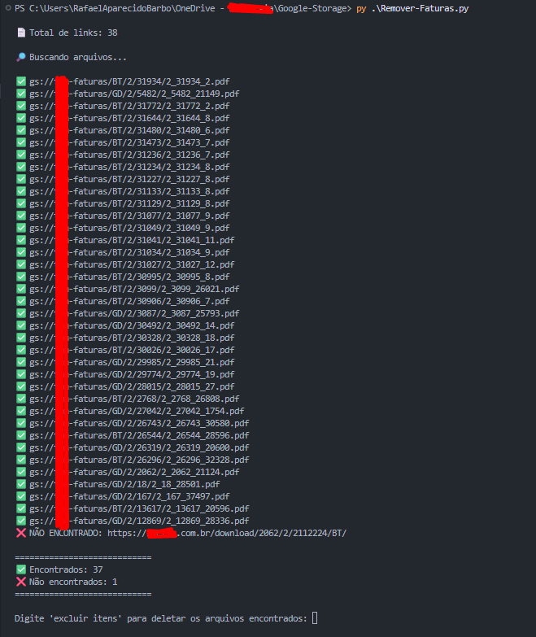
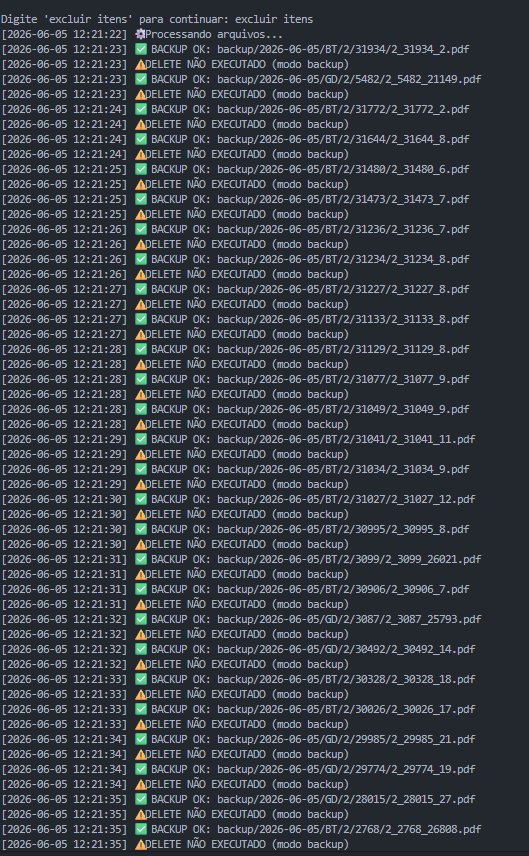
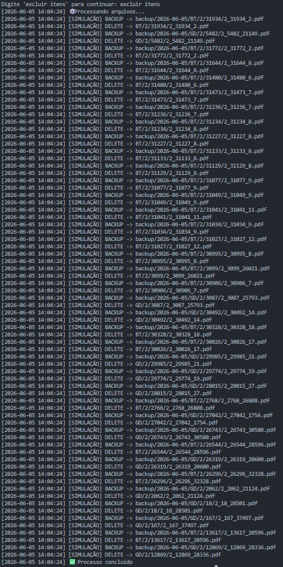
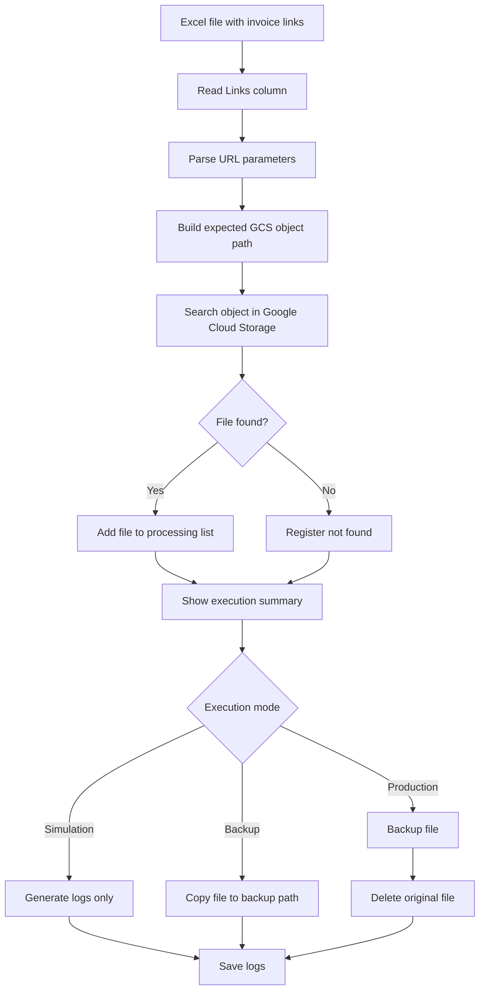

# Invoice Bucket Manager

Python automation tool for locating, validating, backing up and safely removing invoice files stored in Google Cloud Storage.

This project was created to reduce manual work and operational risk when incorrect invoice files are uploaded to a cloud storage bucket.

---

## 🚀 Overview

The tool reads invoice URLs from an Excel spreadsheet, extracts the required parameters, builds the expected object path inside Google Cloud Storage and validates if the file exists.

After validation, the script can run in different execution modes:

- Simulation mode
- Backup-only mode
- Production mode with backup + deletion

---

## 📥 Input Source

The script reads invoice links from an Excel file.

Expected column:

```text
Links
```

Example:

```text
https://example.com/download/2062/2/31934/BT/
https://example.com/download/2062/2/5482/GD/
```

---

## 🧩 File Path Logic

The object path is generated based on URL parameters.

Pattern:

```text
TYPE/COMPANY_CODE/UNIT_CODE/COMPANY_CODE_UNIT_CODE_INVOICE_CODE.pdf
```

Examples:

```text
BT/2/31934/2_31934_31934_2.pdf
GD/2/5482/2_5482_21149.pdf
```

Where:

- `BT` = Low Voltage
- `GD` = Distributed Generation
- `COMPANY_CODE` = Company/customer code
- `UNIT_CODE` = Energy consumer unit code
- `INVOICE_CODE` = Invoice identifier

---

## ⚙️ Execution Modes

### Simulation Mode

Only validates and logs the files.

```text
simulacao
```

Actions:

- Reads Excel file
- Parses invoice URLs
- Searches files in the bucket
- Generates logs
- Does not copy files
- Does not delete files

---

### Backup Mode

Creates backup copies without deleting the original files.

```text
backup
```

Actions:

- Reads Excel file
- Searches files in the bucket
- Copies found files to the backup path
- Keeps original files untouched
- Logs all actions

---

### Production Mode

Creates backup copies and then removes the original files.

```text
producao
```

Actions:

- Reads Excel file
- Searches files in the bucket
- Creates backup using the same original structure
- Deletes original files after backup
- Logs all actions

---

## 🛡️ Safety Workflow

The script does not execute deletion automatically.

Before processing, the user must confirm the operation by typing:

```text
excluir itens
```

This helps prevent accidental deletion.

---

## 🗂️ Backup Strategy

Backups are stored inside the Google Cloud Storage bucket under a dedicated backup path.

Example:

```text
backup/2026-06-05/BT/2/31934/2_31934_31934_2.pdf
backup/2026-06-05/GD/2/5482/2_5482_21149.pdf
```

The backup keeps the original file structure, making future rollback easier.

---

## 📊 Execution Example

```text
[2026-06-05 12:20:32] Início da execução
[2026-06-05 12:20:32] MODO EXECUÇÃO: backup
[2026-06-05 12:20:36] Total de links: 38
[2026-06-05 12:20:36] Iniciando busca...

✅ ENCONTRADO: BT/2/31934/2_31934_2.pdf
✅ ENCONTRADO: GD/2/5482/2_5482_21149.pdf
❌ NÃO_ENCONTRADO: https://example.com/download/2062/2/2112224/BT/

Total encontrados: 37
```

---

## 📸 Screenshots

### File Search Validation



### Backup Execution



### Process Completed



> Sensitive data such as company name, bucket name, domain and real invoice identifiers were anonymized.

---

## 🧭 Current Workflow



---

## 🧰 Technologies

- Python
- Google Cloud Storage
- Excel file processing
- URL parsing
- CLI automation
- Batch processing
- Logging
- Backup workflow

---

## ✅ Implemented Features

- [x] Read invoice links from Excel
- [x] Parse URL parameters
- [x] Build Google Cloud Storage object path
- [x] Search files inside the bucket
- [x] Show found and not found files
- [x] Manual confirmation before processing
- [x] Simulation mode
- [x] Backup-only mode
- [x] Production mode
- [x] Backup using original folder structure
- [x] Execution logs

---

## 📌 Roadmap

- [ ] Generate Excel/CSV execution report
- [ ] Add rollback command
- [ ] Add dry-run report before execution
- [ ] Improve error handling
- [ ] Add unit tests
- [ ] Add configuration file
- [ ] Add CLI arguments
- [ ] Add structured logging in JSON format

---

## 🔐 Security Notes

This repository does not include:

- Real bucket names
- Real company domains
- Credentials
- Service account keys
- Customer data
- Invoice data
- Internal URLs

All examples use anonymized values.

---

## 📄 Planned Report Example

```text
Execution Date: 2026-06-05
Execution Mode: production
Total Links: 38
Found Files: 37
Not Found Files: 1
Backup Created: 37
Deleted Files: 37
Errors: 0
```

---

## 📚 Lessons Learned

This project improved operational reliability by reducing manual lookup time, standardizing cloud storage cleanup, adding backup validation and minimizing the risk of deleting incorrect production files.
